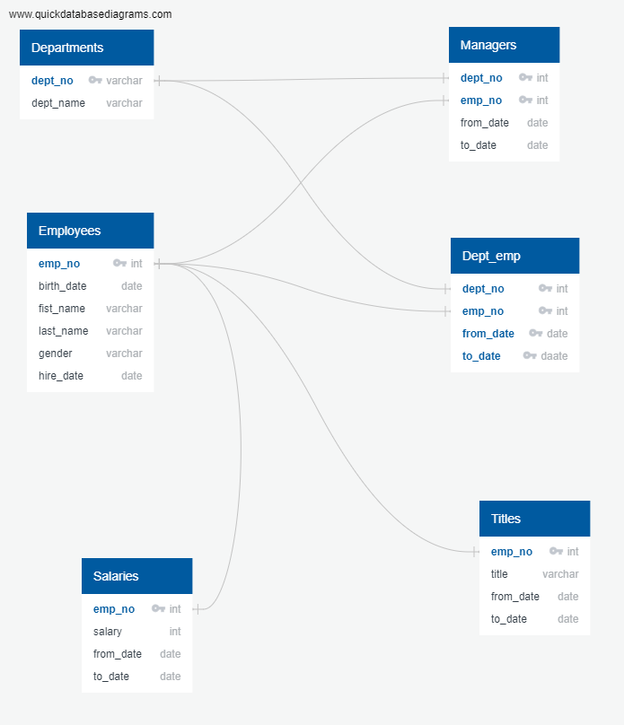
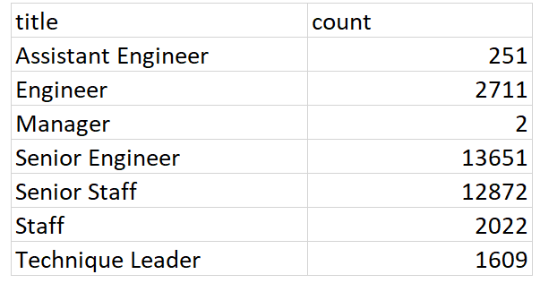
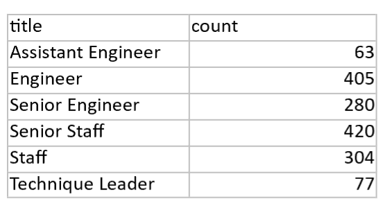

# Pewlett-Hackard-Analysis :
* Identify current employees born between 1952-1955 and hired between 1985-1988 that are eligible for retirement and sum by title. 
* Identify current employees and sum by title.
* Identify current employees eligible for mentoring program born between January 1, 1965 and December 31, 1965. 
* See the ERD below for the file structure : 

## Methodology
# Identify employees eligible for retirement/current employees sum by title  
* To solve for current employees eligible for retirement I created a table using SELECT and joined the employees, dept_emp, titles and salaries. I then utlized the WHERE and AND statement to filter for date of birth between 1952-1955 , AND for hire date and only current employees utlizing a to_date = 9999-01-01. This created the employee_retirement table
* SELECT e.emp_no,
e.first_name,
e.last_name,
s.salary,
de.to_date,
ti.from_date,
ti.title
INTO retirement_employees
FROM employees as e
INNER JOIN salaries as s
	ON e.emp_no = s.emp_no
INNER JOIN dept_emp as de
	ON e.emp_no = de.emp_no
INNER JOIN titles as ti
	ON e.emp_no = ti.emp_no
WHERE (e.birth_date BETWEEN '1952-01-01' AND '1955-12-31')
		AND (hire_date BETWEEN '1985-01-01' AND '1985-12-31')
		AND (de.to_date = '9999-01-01');
* After realizing the table had duplicates because some employees had had more than one job title. I used partioning to filter the data table so that only the most current job titles were show for current employees via the from_date. Here I originally had my from_date from the departments table but realized that it duplicated the date for every title. I think added the from_date from the titles table to get a unique date for each title. This created the employee_retirement_filtered. 
* To count the employees by department I used the Count function on the employee_retirment_filtered table and put them into the employee_eligible_for_retirment_count_title. Total employees by department elgible for retirment are seen below :

# Employees eligible for mentoring program
* I created a table utlizing a select statement and two joins as seen below : 
* --Challenge Tech Analysis 2
--Select employees for mentoring program 
SELECT e.emp_no,
e.first_name,
e.last_name,
de.from_date,
ti.to_date,
ti.title
INTO mentoring_employees
FROM employees as e
JOIN titles as ti
ON (e.emp_no = ti.emp_no)
JOIN dept_emp as de
ON (e.emp_no = de.emp_no)
WHERE (e.birth_date BETWEEN '1965-01-01' AND '1965-12-31')
		AND (de.to_date = '9999-01-01');
		
* I then filtered for duplicates creating the table mentoring_employees_filetered by from_date original pulled from the titles table. 
* Count utilizing the mentoring_employees_filetered table and created the mentoring_employees_count table with the results below: 

## Summary 
* There are currently 33,118 which represents about 14% of the employment population. Pewlett Hackard will need to formulate a plan to recruit, hire and train new staff to replace current staff and/or find efficiences in the current staffing population.
* The total number of employees eligbile for the mentoring program is 1549.That is less than 1% of the total staff population. Pewlett Hackard may want to consider expanding criteria for mentoring program to reflect a population similar to that of the retiring population to ensure adequately trained staff to replace retirees. 

